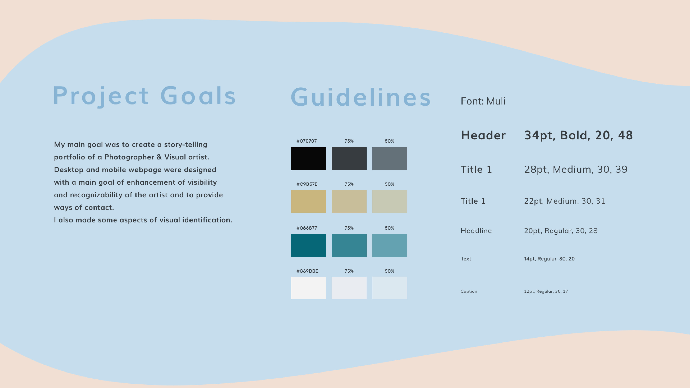
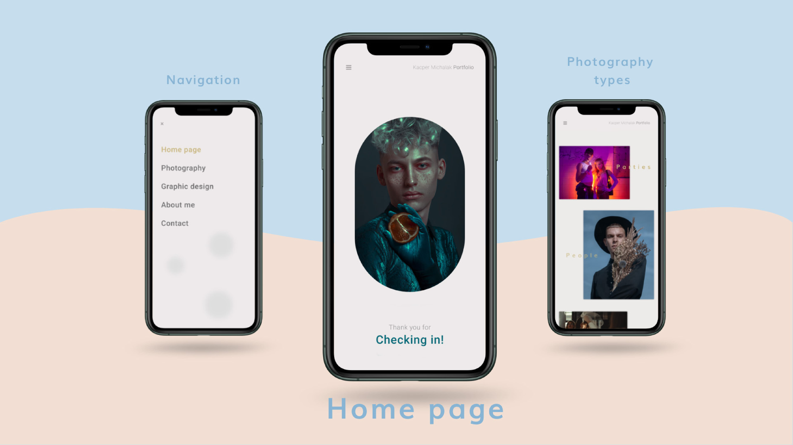
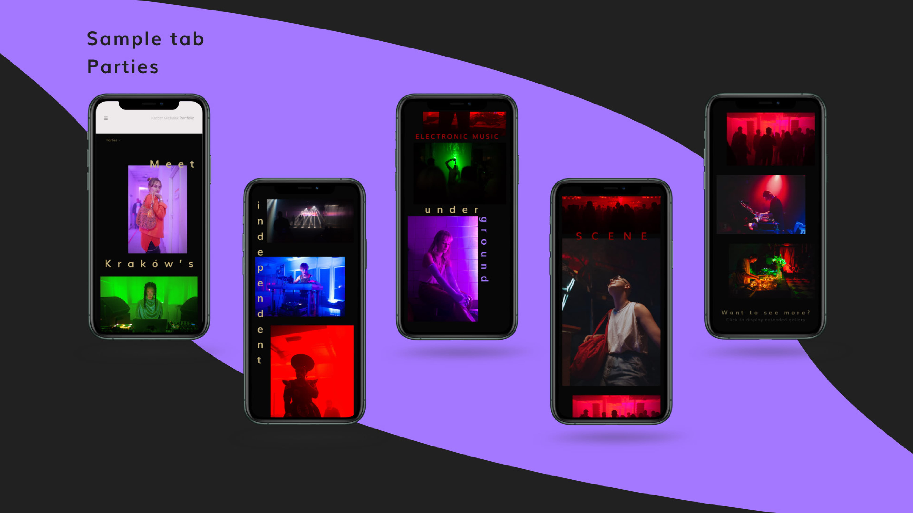
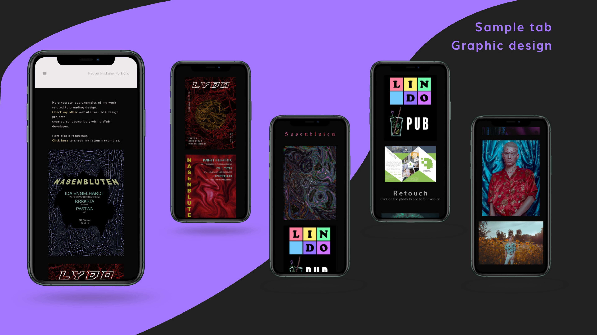
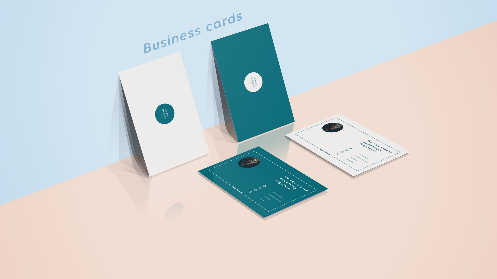
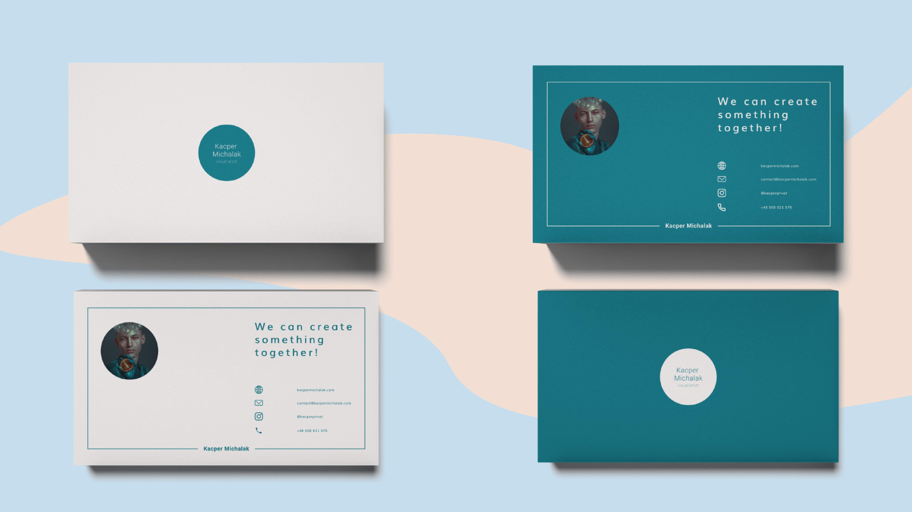
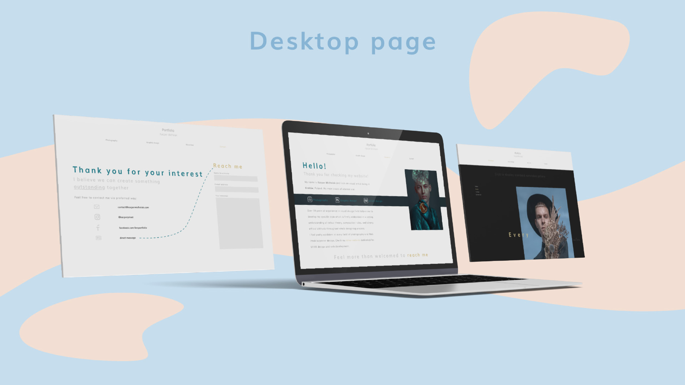
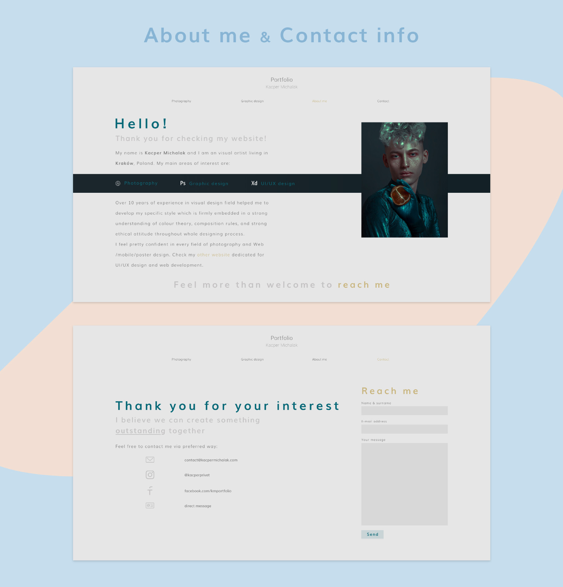
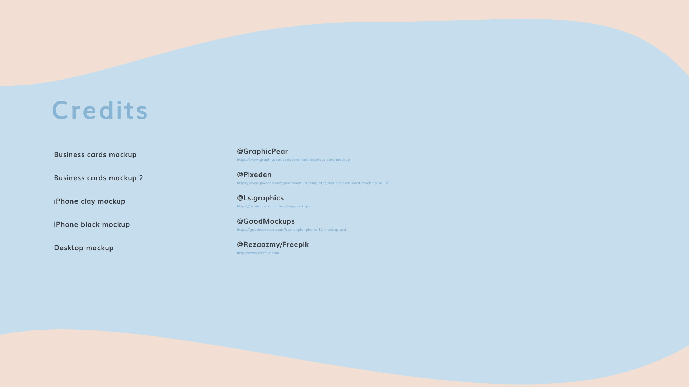

<!-- 

 -->

 
 Live <a href src="https://www.kacpermichalak.com"> websie</a> preview 
 

## About porfolio-km

 Database connections are handled in Repository with Laravel ORM.

 Vue components manage asynchronous API calls. 

 ViewControlller is responsible for rendering proper view and its transitions. 

 Reusable components are stored in '/components/partials'.

 Code and project patterns are explained on my <a href="https://www.google.com"> blog </a>. 

## Built with
- Laravel
- Vue js, Vuex, Vue router
- axios
- scss (flexbox, RWD)
- HTML5
### Features
- Vue router page transitions handled by ViewController
- css animations and transitions
- state management
- REST API
- async & await
### ?
- Adobe XD
## Mockup

